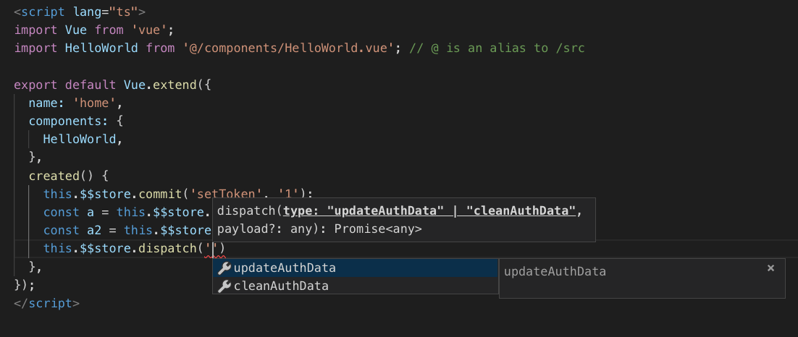
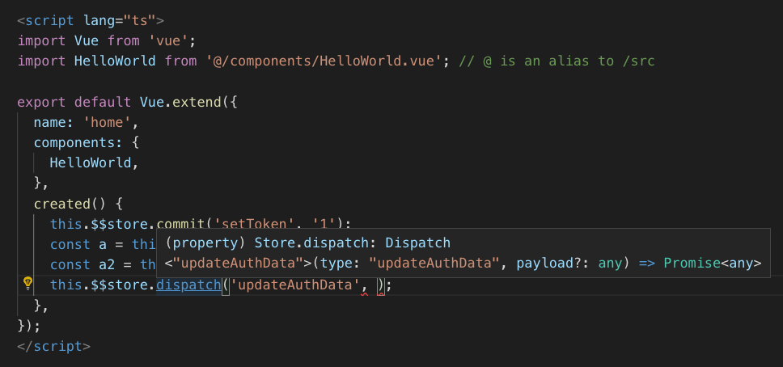

# 一个让 vuex 更好的支持 typescript 的解决方案

传统 vuex 编码让人觉得麻烦的一点就是 state、getters、mutation、dispatch 在调用时无法获得编辑器的智能提示，必须切换文件去查找。本以为用上 typescript 后这个问题可以得到解决，却发现并没有...

在找寻了一会儿各种解决方案后，觉得都存在这样或那样的问题，所以便自己写了这么一个解决方案。

demo 项目由 vue-cli 3 生成，IDE 为 VSCODE

## 效果展示

### 1.   state


state 会显示所有的 module、里面的属性及属性的类型

**/src/store/modules/auth.ts**

```js
const moduleState = {
  token: '',
  tokenExpire: 0,
}
```


### 2.   getters

getter 可以显示值类型


**/src/store/modules/auth.ts**

```js
const moduleGetters = {
  isLogin(state: State, getters: any, rootState: Store['state'], rootGetters: any) {
    return !!state.token && (!!rootState.user.userId || !!rootState.user.accountId);
  },
};
```


### 3.  commit


commit 会显示所有注册的 mutation


**/src/store/modules/auth.ts**

```js
const mutations = {
  setToken(state: State, payload: State['token']) {
    state.token = payload || '';
  },
  setTokenExpire(state: State, payload: State['tokenExpire']) {
    state.tokenExpire = payload || 0;
  },
};
```


**/src/store/modules/user.ts**

```js
const mutations = {
  setAccountId(state: State, payload: State['accountId']) {
    state.accountId = payload || '';
  },
  setUserId(state: State, payload: State['userId']) {
    state.userId = payload || '';
  },
  setUserInfo(state: State, payload: State['info']) {
    state.info = payload || {};
  },
};
```


**/src/store/modules/pageCache.ts**

```js
const mutations = {
  setPageToCache(state: State, payload: any) {
    state.pagesName.unshift(payload.pageName);
    setTimeout(() => {
      if (payload.callback) payload.callback();
    }, 0);
  },
  resetPageCache(state: State) {
    state.pagesName = [...cachePages];
  },
};
```


### 4.   dispatch

和 commit 类似





**/src/store/modules/auth.ts**

```js
const actions = {
  updateAuthData({ commit }: ActionContext<State, Getters>, payload: any) {
    commit('setToken', payload.token);
    commit('setTokenExpire', payload.expire);
  },
  cleanAuthData({ commit }: ActionContext<State, Getters>) {
    commit('setToken', '');
    commit('setTokenExpire', 0);
  },
};
```


## 实现方式

上面可以看到，这个方案在保证了 vuex 原来的写法（稍微有一点点变化，从 this.$store 换为 this.\$\$store）上支持了 typescript 的类型检查，为了实现它，vuex 的 store 在初始化的时候我们需要做一些额外的工作，但是也仅限于这一点额外的工作了，后续的 module（业务）的增加，也完全像 vuex 本来的写法那样去定义各种 state、getters、mutation、action，一劳永逸的获得 typescript 对 vuex 各种调用的支持。

### 1.  改造 vuex 部分

以下是最基本的 vuex 代码

**/store/modules/auth.ts**

```js
// ts 校验会提示好几个函数具有隐式 any 入参，暂略过
const moduleState = {
  token: '',
  tokenExpire: 0,
};

const moduleGetters = {
  isLogin(state, getters, rootState, rootGetters) {
    return !!state.token && (!!rootState.user.userId || !!rootState.user.accountId);
  },
};

const mutations = {
  setToken(state, payload) {
    state.token = payload || '';
  },
  setTokenExpire(state, payload) {
    state.tokenExpire = payload || 0;
  },
};

const actions = {
  updateAuthData({ commit }, payload) {
    commit('setToken', payload.token);
    commit('setTokenExpire', payload.expire);
  },
  cleanAuthData({ commit }) {
    commit('setToken', '');
    commit('setTokenExpire', 0);
  },
};

export default {
  state: moduleState,
  getters: moduleGetters,
  mutations,
  actions,
};
```

**/store/index.ts**

```js
import Vue from 'vue';
import Vuex from 'vuex';

import auth from './modules/auth';
import user from './modules/user';
import pageCache from './modules/pageCache';

Vue.use(Vuex);

const store = new Vuex.Store({
  modules: {
    auth,
    user,
    pageCache,
  },
});
export default store;
```

****


### ***下面我们给它加一点 `Magic`***

**/store/index.ts**

```js
import Vue from 'vue';
import Vuex from 'vuex';

import auth from './modules/auth';
import user from './modules/user';
import pageCache from './modules/pageCache';

Vue.use(Vuex);

// 从 module 的 state 中提取 state 的类型并集合
interface State {
  auth: typeof auth.state;
  user: typeof user.state;
  pageCache: typeof pageCache.state;
}
// 将 getter 函数转换成 {getterName: getterFuncsReturnType} 的对象类型
export type ReturnGetters<T extends { [key: string]: (...args: any) => any }> = {
  [P in keyof T]: ReturnType<T[P]>;
}
// 提取所有 module 的 getter 函数类型对象
type GettersFuncs = (
  typeof auth.getters
  & typeof user.getters
  & typeof pageCache.getters
)
// 将 getter 转换成对象
type Getters = ReturnGetters<GettersFuncs>
// 提取 mutation 函数类型
type CommitFuncs = (
  typeof auth.mutations
  & typeof user.mutations
  & typeof pageCache.mutations
)
// 将 mutation 函数名及 payload 类型转换成 commit 函数的两个入参类型
interface Commit {
  <T extends keyof CommitFuncs>(type: T, payload?: Parameters<CommitFuncs[T]>[1]): void;
}
// dispatch 处理步骤同 commit
type DispatchFuncs = (
  typeof auth.actions
  & typeof user.actions
  & typeof pageCache.actions
)
interface Dispatch {
  <T extends keyof DispatchFuncs>(type: T, payload?: Parameters<DispatchFuncs[T]>[1]): Promise<any>;
}

const store = new Vuex.Store<State>({
  modules: {
    auth,
    user,
    pageCache,
  },
});
export default store;

// 其他 ts 文件解构导入时获得每个对象的改造后类型
export const { state } = store;
export const { getters }: { getters: Getters } = store; // 定义 getters 的类型
export const { commit }: { commit: Commit } = store; // 定义 commit 的类型
export const { dispatch }: { dispatch: Dispatch } = store; // 定义 commit 的类型

// 导出类型 Store 以便在 Vue 原型上定义类型
export interface Store {
  state: State;
  getters: Getters;
  commit: Commit;
  dispatch: Dispatch;
}
```


为了避免循环引用，我们需要在 /src/ 下面建一个 .d.ts 文件 ，来让 module 可以引用到全局的 State (rootState、commit、dispatch)

**/src/types/store.d.ts**

```js
import { Store as s } from '../store/index';

export { ReturnGetters } from '../store/index';
export interface Store extends s {}
export interface ActionContext<S, G> {
  dispatch: Store['dispatch']; // 全局的 dispatch, 有 ts 提示支持
  commit: Store['commit']; // 全局的 commit, 有 ts 提示支持
  state: S;
  getters: G;
  rootState: Store['state']; // 全局的 state, 有 ts 提示支持
  rootGetters: any; // 暂时还无法实现将全局 getter 定义过来，会出现类型循环引用问题
}
```


**最后去修改我们的 module**

**/src/store/modules/auth.ts**

```js
import { ReturnGetters, Store, ActionContext } from '../../types/store';

const moduleState = {
  token: '',
  tokenExpire: 0,
};
type State = typeof moduleState; // 提取 state 类型

const moduleGetters = {
  isLogin(state: State, getters: any, rootState: Store['state'], rootGetters: any) {
    return !!state.token && (!!rootState.user.userId || !!rootState.user.accountId);
  },
};
type Getters = ReturnGetters<typeof moduleGetters>; // 提取 getter 类型

const mutations = {
  setToken(state: State, payload: State['token']) {
    state.token = payload || '';
  },
  setTokenExpire(state: State, payload: State['tokenExpire']) {
    state.tokenExpire = payload || 0;
  },
};

const actions = {
  updateAuthData({ commit }: ActionContext<State, Getters>, payload: any) {
    commit('setToken', payload.token);
    commit('setTokenExpire', payload.expire);
  },
  cleanAuthData({ commit }: ActionContext<State, Getters>) {
    commit('setToken', '');
    commit('setTokenExpire', 0);
  },
};

export default {
  state: moduleState,
  getters: moduleGetters,
  mutations,
  actions,
};
```


### 2.改造 vue 实例化 vuex 部分

**/src/main.ts**

```js
import Vue from 'vue';
import App from './App.vue';
import router from './router';
import store, { Store } from './store/index'; 
// 其他 ts 文件在直接解构引入的时候，也可以获得智能提示
// import { state, getters, commit, dispatch } from './store/index';

Vue.config.productionTip = false;

const app = new Vue({
  router,
  store,
  render: h => h(App),
}).$mount('#app');

// 将改造过后的 Store 类型声明到 vue 的原型上，这样就可以在.vue 文件中获得 IDE 的智能提示了
// 因为下面去声明一个新的 Store 类型的时候，无法覆盖 vue 原有的 $store 类型声明，所以采取一个新的名字 $$store 来应用新的类型，本质上都是 app.$store
Vue.prototype.$$store = app.$store;

declare module 'vue/types/vue' {
  interface Vue {
    $$store: Store;
  }
}

```


### 至此 vuex 的 typescript 支持改造就完成了，可以愉快的使用 vuex 又不用来回切文件找名字了，并且名字不对的时候 ts 还会校验错误，妈妈再也不用担心我写错名字了~

ps: 这个方案可能还不够好（rootGetters 类型没有实现等...），欢迎各位交流学习

ppps: 本来想着将这些 ts 类型的代码抽离成一个工具库，但是初步想了一下有点难度，就先以 demo 的形式分享一下


## demo 

代码拉下来以后

```shell
yarn install
```

之后就可以在 .vue 文件和 .ts 文件中体验 vuex 获得智能提示的便利了~